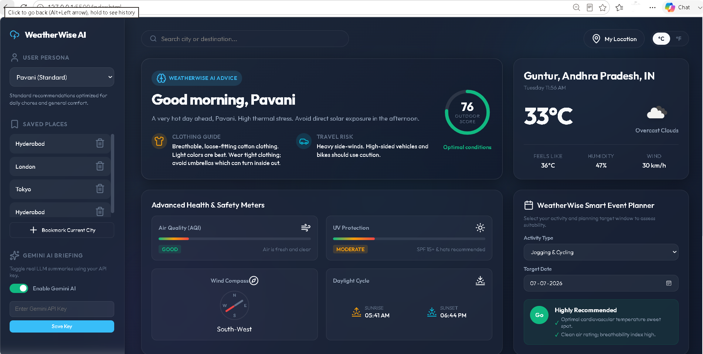
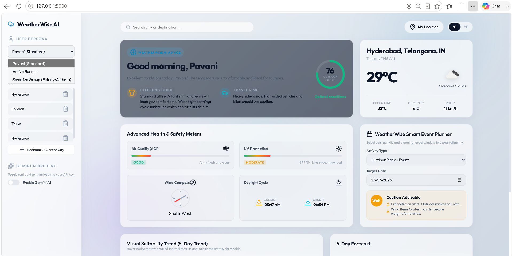
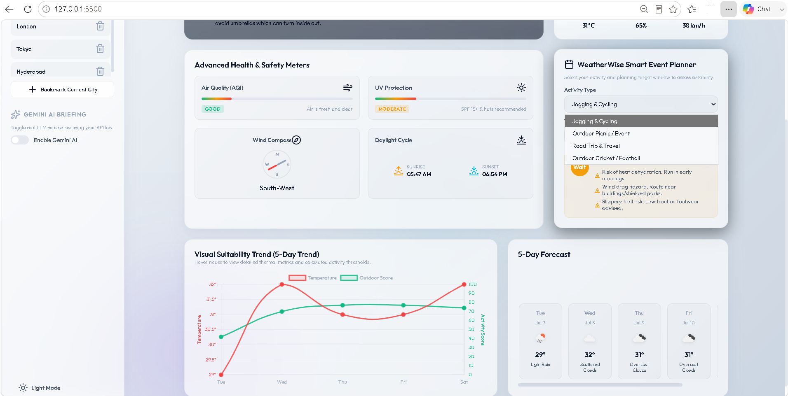
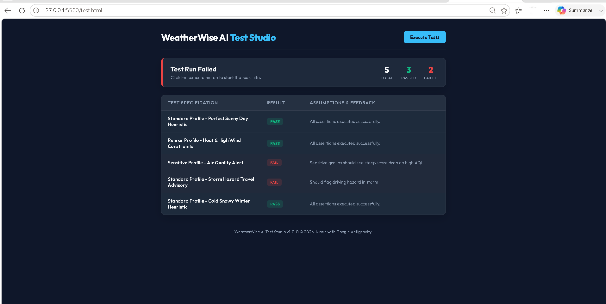

# 🌦️ WeatherWise AI – Personal Weather Decision Assistant

A real-time weather decision intelligence system designed for daily planning support. Instead of just displaying raw weather metrics (like temperature, humidity, wind, and AQI), **WeatherWise AI** parses atmospheric vectors against customizable user personas to generate actionable recommendations (clothing advice, travel risks, and outdoor score meters).
## 🚀 Live Demo
👉 **[Live Demo - WeatherWise AI](https://weatherassitant.netlify.app/)**

## 📸 Core Engineering Showcases (Screenshots)

### 🧠 1. Weather Heuristic Decision Board (`weather_decision_heuristics.png`)
*Highlights the client-side rule engine converting atmospheric metrics into safety actions (clothing guides, travel warning parameters, and composite outdoor score).*

### 👥 2. Dynamic User Profile Thresholding (`persona_threshold_evaluation.png`)
*Demonstrates how safety indexes, comfort ranges, and warnings instantly adapt to standard, athletic (runner), or sensitive user profiles.*

### 📅 3. Predictive Event & Travel Planner (`activity_planner.png`)
*Showcases the event assessor matching selected forecast days against sports, road-trip, or outdoor event thresholds.*

### 🧪 4. Automated Safety Assertions & Test Suite (`automated_safety_assertions.png`)
*Proves code testability and correctness under extreme simulated weather vectors (high heat, blizzards, poor AQI).*

---

## 🚀 Key Features

1. **WeatherWise AI Advisory Engine**:
   - **Personalized Greeting**: Contextual morning/afternoon/evening greetings.
   - **Smart Briefing**: Synthesized summary highlighting the major atmospheric concern.
   - **Clothing & Travel Guides**: Real-world safety action items (e.g. high-wind alerts, visibility hazards, hydroplaning risks).
   
2. **User Profiles (LocalStorage Saved)**:
   - **Standard (Pavani)**: Balanced thresholds for standard daily tasks.
   - **Active Runner**: High sensitivity to high humidity, air quality index (AQI), and wind.
   - **Sensitive Group**: Extra protective warnings for UV index and air pollution.

3. **Smart Event Planner**:
   - Input outdoor activities (picnics, cricket, running, travel) and pick a target date from the 5-day calendar.
   - The engine filters the midday forecast and generates a **Go/Wait/No-Go** risk checklist.

4. **Visual Analytics**:
   - Interactive line chart mapping temperature trends against calculated activity scores over a 5-day cycle using **Chart.js**.

5. **Automated Browser Unit Testing**:
   - Dedicated `test.html` visual runner verifying heuristic equations across five extreme weather conditions.

---

## 🛠 Tech Stack & Dependencies

- **Frontend**: Semantic HTML5, CSS3 Custom Properties (Variables, Keyframe Animations)
- **Logic & Calculations**: Vanilla ES6+ Object-Oriented JavaScript
- **Meters & Icons**: Lucide SVG Icons (via CDN)
- **Data Plotting**: Chart.js (via CDN)

---

## 📖 Setup & Deployment Instructions

### 1. How to Run Locally
1. Clone or download this repository.
2. Double-click `index.html` to open in any web browser.
3. For hot-reloading, open the folder in **VS Code** and click **Go Live** at the bottom right (using the Live Server extension).

### 2. How to Run Unit Tests
- Simply open `test.html` in your browser to view the test runner execution results.

### 3. Netlify Deployment (Drag-and-Drop)
1. Log in to [app.netlify.com](https://app.netlify.com/).
2. Drag and drop the project folder directly into the upload area.
3. Add the resulting live URL to your GitHub repository details!
